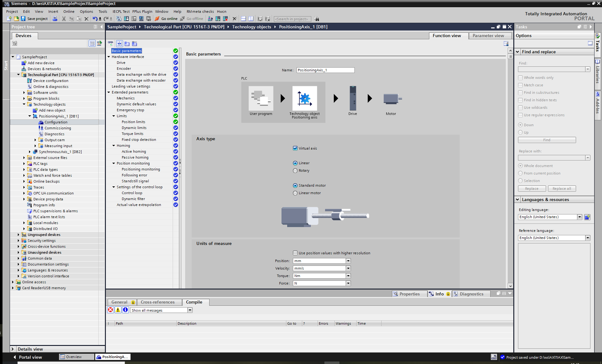
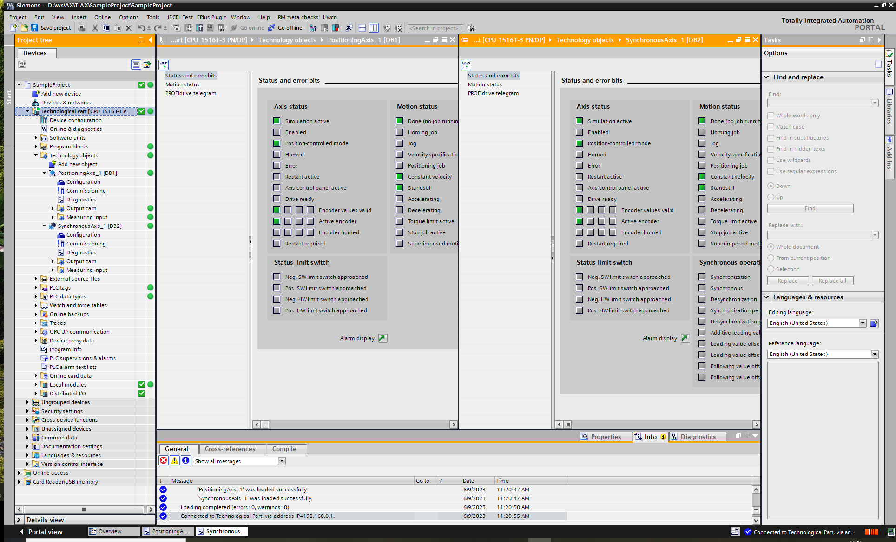

# TIAX direct loading workflow

## About this example
This example describes the different phases of the `TIAX direct loading` workflow using PlcSim Advanced. A positioning axis and a synchronous axis which are coupled via a master-slave configuration are used. To execute the application example, following steps are required:

1. Prepare the hardware configuration and the technology objects in a TIA Portal project and download them to your target.

    > The TIAP project is not part of this application example. Please create it yourself.

2. Create a Motion application example in SIMATIC AX and download it to your target next to the technological objects, which are coming from the TIAP project download.

    > This SIMATIC AX project is part of this application example. You can reuse it.

3. Use the diagnostic tools from both the TIAP as well as SIMATIC AX to verify the operation of your application.

## Create a Motion Control project with TIA Portal

- Open TIA Portal and create a project
-  Add a `SIMATIC S7-1500 T-CPU` - for instance a CPU 1516T-3 PN/DP with firmware version 3.0 or above.
   For this example you can disable the option `Protect confidential PLC configuration data` in the creation wizard and set the `Access level without password` to `Full access`.
-  Add a technology object of the type `Positioning Axis` with version `8.0` and mark the property `Virtual axis` in the `Axis type` section. It should have the block number 2 [DB02].
   
-  Add a technology object of type `Synchronous Axis` with the same version and again, mark `Virtual axis` in the `Axis type` section. It should have the block number 3 [DB03].  
   Because we are using a gearing functionality you must assign a master axis in the `Hardware interface / Leading value interconnections` property of the technology object `Synchronous Axis`. Choose the newly created positioning axis in `Possible leading values` with the `Type of Connection` 'Setpoint'.
-  Start a PlcSim Advanced instance and activate the project support for compiling for simulated targets in TIA portal project settings.
-  Compile and Download the project (Hardware and Software) to the PlcSim Adavanced instance.

## Create a Motion Control application in SIMATIC AX

- Open a shell and navigate to a folder on your local hard disk where the application should be stored.
- Login to using `Apax` to the product registry `@ax` with your credentials.
   ```sh 
   apax login
   ```
- Create a new application, install dependencies and open the created application with AxCode:

   ```sh
   apax create @simatic-ax/ae-motion-tiax-dl --registry https://npm.pkg.github.com my-new-motion-tiax-dl-project
   ```
   ```sh
   cd my-new-motion-tiax-dl-project
   apax install
   axcode .
   ```
    > Note: This is the "out-of-the-box" solution. You can jump to [chapter-3](#Start-the-Motion-application-example-and-verify-the-operation) directly now.


    If you want to start fresh and recreate the application by your self follow the next steps instead.

   ```sh
   apax create app my-new-motion-tiax-dl-project
   ```
   ```sh
   cd my-new-motion-tiax-dl-project
   apax install
   axcode .
   ```

- Open a terminal inside AxCode and add the reference to the Motion library:

   ```sh
   apax add @ax/simatic-1500-motioncontrol-native-v8
   ```

   > The library version you choose must fit to the library version of 'Motion Control' technology in your TIA-Portal project.

- Add a file with the name `SampleAxisFB.st` below to the `src`-folder:
  
    <details><summary>"SampleAxisFB.st" content</summary>

    ```iecst
    USING Siemens.Simatic.S71500.MotionControl.Native;

    NAMESPACE My.Tiax.MotionControl

    TYPE
        ExecState : USINT
            (Idle := usint#0, Init := usint#1, Power := usint#2
            , Home := usint#3, Gearing := usint#4, Positioning := usint#5, GearOut := USINT#6
            , Error := usint#13) := Idle;
    END_TYPE

    FUNCTION_BLOCK  SampleAxisFB
        VAR_INPUT
            axisPos     : DB_ANY;
            axisSync    : DB_ANY;

            execute     : BOOL;
            requiredPos : LREAL;
        END_VAR

        VAR
            execState   : ExecState;
            prevExecute : BOOL;

            powerPos, powerSync : Mc_Power;
            homePos, homeSync   : Mc_Home;
            moveAbs             : MC_MoveAbsolute;
            gearInPos           : MC_GearInPos;
            gearOutPos          : MC_GearOut;
        END_VAR

        IF execute <> prevExecute  THEN
            prevExecute := execute;
            IF prevExecute  THEN
                execState := ExecState#Init;
            END_IF;
        END_IF;

        CASE execState OF
            ExecState#Init:
                // verify passed DBs
                IF AsPositioningAxisRef(axisPos) <> null AND AsSynchronousAxisRef(axisSync) <> null  THEN
                    execState := ExecState#Power;
                ELSE
                    execState := ExecState#Error;
                END_IF;

            ExecState#Power:
                // power on the positioning and synchronous axis
                powerPos(Axis := AsAxisRef(axisPos)^, enable := TRUE);
                IF powerPos.Error = TRUE  THEN
                    execState := ExecState#Error;
                END_IF;
                powerSync(Axis := AsAxisRef(axisSync)^, enable := TRUE);
                IF powerSync.Error = TRUE  THEN
                    execState := ExecState#Error;
                END_IF;

                IF powerSync.Status = TRUE AND powerPos.Status = TRUE  THEN
                    homePos(Axis := AsAxisRef(axisPos)^, execute := FALSE);
                    homeSync(Axis := AsAxisRef(axisSync)^, execute := FALSE);
                    execState := ExecState#Home;
                END_IF;

            ExecState#Home:
                // home positioning and synchronous axis
                homePos(Axis := AsAxisRef(axisPos)^, execute := TRUE, mode := 0, Position := LREAL#0.0);
                IF (homePos.Error = TRUE) THEN
                    execState := ExecState#Error;
                END_IF;
                homeSync(Axis := AsAxisRef(axisSync)^, execute := TRUE, mode := 0, Position := LREAL#0.0);
                IF (homeSync.Error = TRUE) THEN
                    execState := ExecState#Error;
                END_IF;

                IF homeSync.Done = TRUE AND homePos.Done = TRUE  THEN
                    gearInPos(Master := AsAxisRef(axisPos)^
                        , Slave := AsSynchronousAxisRef(axisSync)^
                        , execute := FALSE);
                    execState := ExecState#Gearing;
                END_IF;

            ExecState#Gearing:
                // connect synchronous axis (Slave) to positioning axis (Master)
                gearInPos(Master := AsAxisRef(axisPos)^, Slave := AsSynchronousAxisRef(axisSync)^,
                    Execute            := TRUE,
                    RatioNumerator     := DINT#2,
                    RatioDenominator   := DINT#1,
                    MasterSyncPosition := LREAL#0.0,
                    SlaveSyncPosition  := LREAL#0.0,
                    SyncProfileReference := DINT#3, // ab pos 0 nachlaufend aufsynchronisieren
                    MasterStartDistance := requiredPos/LREAL#2.0
                );

                IF gearInPos.Busy = TRUE  THEN
                    moveAbs(Axis := AsPositioningAxisRef(axisPos)^, Execute := FALSE);
                    execState := ExecState#Positioning;
                END_IF;

            ExecState#Positioning:
                // positioning the leading axis
                moveAbs(Axis := AsPositioningAxisRef(axisPos)^
                    , Execute := TRUE
                    , Position := requiredPos
                    , Velocity := LREAL#50.0
                    , Direction := 3
                );

                IF moveAbs.Error = TRUE  THEN
                    execState := ExecState#Error;
                ELSIF (moveAbs.Done = TRUE) then
                    execState := ExecState#GearOut;
                    gearOutPos(execute := FALSE, Slave := AsSynchronousAxisRef(axisSync)^);

                END_IF;

            ExecState#GearOut:
                gearOutPos(execute := TRUE, Slave := AsSynchronousAxisRef(axisSync)^, SlavePosition := requiredPos * 2.0, SyncProfileReference := 0);

                IF gearOutPos.Error = TRUE  THEN
                    execState := ExecState#Error;
                ELSIF (gearOutPos.Done = TRUE) then
                    execState := ExecState#Idle;
                END_IF;

            ExecState#Error:
                ;
            ELSE // idle
                ;
        END_CASE;

    END_FUNCTION_BLOCK

    END_NAMESPACE
    ```

    </details>

- Set the `Interval` of the Main-Task in the file `configuration.st` to `10ms` and add the following two variables to the `VAR_GLOBAL` section of the configuration.st file :

    ```iecst
    Execute     : BOOL;
    RequiredPos : LREAL;
    ```

- Edit the file `program.st` below the `src`-folder to call the sample FB:
    <details><summary>"program.st" content</summary>

    ```iecst
    USING My.Tiax.MotionControl;

    PROGRAM MyProgram
        VAR_EXTERNAL
            Execute     : BOOL;
            RequiredPos : LREAL;
        END_VAR

        VAR
            motionFB    : SampleAxisFB;
        END_VAR

        VAR CONSTANT
            posAxisDB   : UINT := UINT#2;
            syncAxisDB  : UINT := UINT#3;
        END_VAR

        motionFB(posAxisDB, syncAxisDB, Execute, RequiredPos);
        
    END_PROGRAM
    ```

    </details>

    Notice:  if you are using other block/DB-numbers for the technological objects you need to adapt the numbers in the CONSTANT section accordingly.

- Save the project, build the application and download it to PLCSimAdv instance with the `--non-overwriting` option of the `sdl` (software-loader) tool :

    ```sh
    apax build
    ```
    ```sh
    apax sld load --non-overwriting --mode:delta -i ./bin/1500 -t 192.168.0.1 --restart --accept-security-disclaimer
    ```

## Start the Motion application example and verify the operation 

  Note : In the TIAX directloading use-case both, TIA-Portal and SIMATIC AX can be online on the same target at the same time in order to do diagnostics and debugging.

- In TIA-Portal : Open the diagnostics windows of both axis side-by-side and start monitoring (via the icon in the upper left corner of each window).
   

- In SIMATIC AX : Set the required position and start the execution of the application. Therefore use the `mod` tool with the following commands:

    ```sh
    apax mod -t 192.168.0.1 --symbol RequiredPos --value 1000.0
    apax mod -t 192.168.0.1 --symbol Execute     --value true
    ```
    Optional: Create a watchtable in your root-directory with the name `watchlist.mon` and add the following variables:

    ```txt
    execute
    requiredPos
    motionFB.execState
    motionFB.moveAbs
    motionFB.gearOutPos
    ```
    Press the "go-online" button on the top right of the file to monitor the values.

- In TIA-Portal : Watch how the positioning axis moves to position 1000.0 and the synchronous axis to 2000.0. Afterwards the velocity is reduced to 0.
